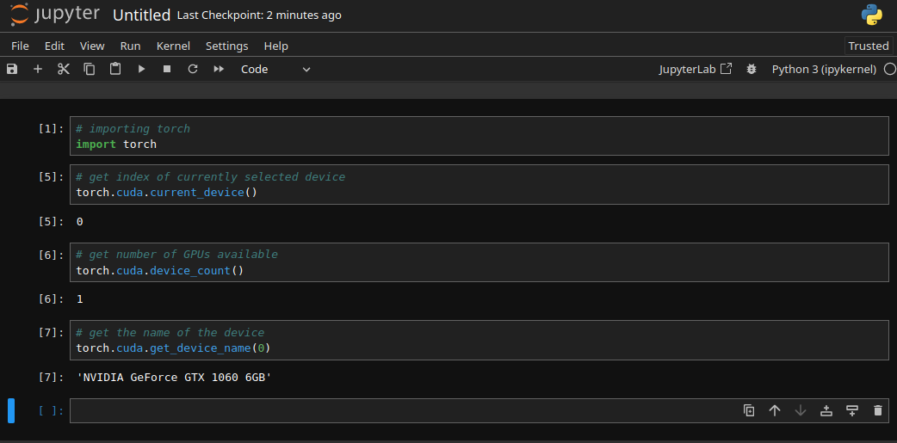

# Containerized PyTorch Dev Workflow 

Develop your PyTorch models inside the official PyTorch container image __with__ Jupyter Notebooks.

## Running the Container

Let's build this custom image with:


```bash
docker build -t pytorch-jupyter . -f Dockerfile
```

I can now create the container and mount my working directory into the container WORKDIR to get started:


```bash
docker run --gpus all -ti --rm \
    -v $(pwd):/opt/app -p 8888:8888 \
    --name pytorch-jupyter \
    pytorch-jupyter:latest
```


```bash
[C 2023-08-21 08:47:56.598 ServerApp] 
    
    To access the server, open this file in a browser:
        file:///root/.local/share/jupyter/runtime/jpserver-7-open.html
    Or copy and paste one of these URLs:
        http://e7f849cdd75e:8888/tree?token=8d72a759100e2c2971c4266bbcb8c6da5f743015eecd5255
        http://127.0.0.1:8888/tree?token=8d72a759100e2c2971c4266bbcb8c6da5f743015eecd5255
```


### Verify PyTorch




### Troubleshooting

> `ERROR: Unexpected bus error encountered in worker. This might be caused by insufficient shared memory (shm).`

Please note that PyTorch uses shared memory to share data between processes, so if torch multiprocessing is used (e.g. for multithreaded data loaders) the default shared memory segment size that container runs with is not enough, and you should [increase shared memory size](https://github.com/pytorch/pytorch#using-pre-built-images) either with --ipc=host or --shm-size command line options to nvidia-docker run.


```bash
docker run --ipc=host --gpus all -ti --rm \
    -v $(pwd):/opt/app -p 8888:8888 \
    --name pytorch-jupyter \
    pytorch-jupyter:latest
```